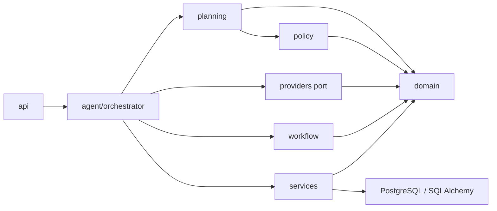
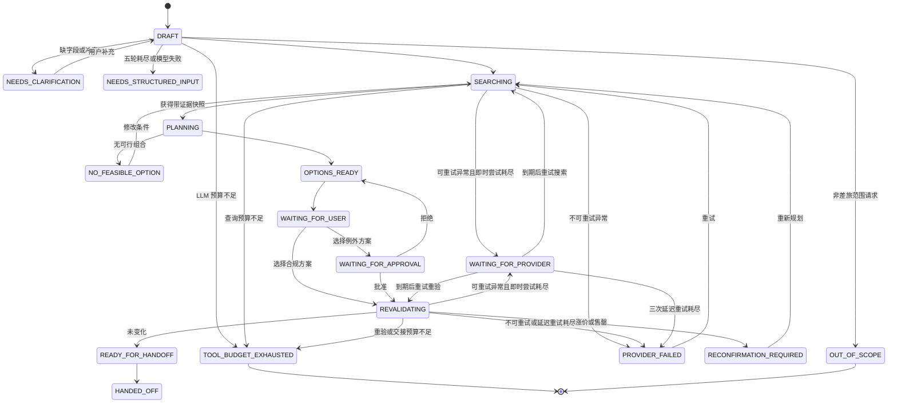

# V1 Agent 框架设计

## 1. 设计结论

框架采用一个有界 Workflow Orchestrator，而不是默认拆成多个 Agent。语言模型是被编排的能力端口，不能控制政策结论、状态转换、审批有效性或任何经济/外部副作用。

一次循环固定为：

```text
Observe  读取任务状态、版本、工具结果和有效期
Decide   由状态机确定允许动作
Act      调用有类型约束的 Provider 或 LLM 端口
Verify   schema、可行性、政策和不变量校验
Persist  保存对象、状态和证据哈希
Pause    等待用户、审批、重新确认或安全失败
```

## 2. 分层与依赖方向



`domain` 不依赖 FastAPI、数据库或供应商 SDK。当前可在内存与 PostgreSQL 仓储之间切换；把 Mock 替换为正式 TMC API 也不需要重写规划和政策核心。

离线评测层使用严格 manifest 和固定来源哈希加载派生案例。PreferTripPlan 案例通过 Mock Provider 逐条运行同一个 Orchestrator、Planner 和 Policy Engine；Open-Travel 仅提供中文 query 与机器可检查的分类/缺失字段约束，不采用数据中的模型回答作为标准答案。

## 3. Agent 与确定性内核的边界

| 能力 | LLM | 确定性代码 |
|---|---:|---:|
| 自然语言意图提取 | 是 | schema 验证 |
| 硬/软约束初步分类 | 是 | 最终约束执行 |
| 搜索调整建议 | 仅白名单内 | 次数与范围控制 |
| 行程组合、成本和时间 | 否 | 是 |
| 合规结论 | 否 | 是 |
| 方案解释 | 仅引用 `explanation_facts` | 生成事实集 |
| 审批有效性、幂等和交接 | 否 | 是 |
| 员工习惯画像（从历史推偏好） | 否 | 是 |

语言模型只负责完整对话的语义解释、白名单查询调整和已验证方案解释。生产实现必须使用结构化输出，并在进入领域层前完成 schema 校验。

新的意图 seam 是一个深模块：

```text
ConversationLedger -> ConversationIntentInterpreter -> IntentDecision
                                                |
                                                v
                                   compile_search_command
                                                |
                            clarification <-----+-----> TripRequestVersion
```

`ConversationLedger` 是原始语义事实来源。`SemanticIntent` 可以保留多个候选城市、条件、
未决信息和后续修正；它不是搜索参数。仅当 `IntentDecision.status == READY` 时，
`compile_search_command()` 才能生成经过确定性校验的请求。编译器不补城市或日期默认值，
任何会改变搜索结果的歧义都返回澄清。

新旧链路通过不同入口并行存在，不使用运行时 mode 分支：

- 旧链路：`POST /legacy/trip-tasks` 和
  `POST /legacy/trip-tasks/{task_id}/messages`；
- 新链路：`POST /semantic/trip-tasks` 和
  `POST /semantic/trip-tasks/{task_id}/messages`；
- 结构化入口：`POST /trip-tasks`。

任务创建时固定 `intent_entrypoint`，后续消息不得跨入口提交。旧入口只调用
`LanguageModelPort.extract_trip_intent`；新入口只调用
`SemanticLanguageModelPort.interpret_trip_intent`，不会回退到旧抽取。二者仅在产出经过验证的
`TripRequestVersion` 后共享搜索、政策、审批和交接流程。删除旧链路的评测门槛见
[ADR-0002](adr/0002-single-owner-semantic-intent.md)。

旧 `legacy` 自然语言入口使用两层验证：

1. `IntentExtractionSchema` 限定模型只能返回差旅行程字段、字段来源、缺失项、冲突、假设和操纵标记；
2. Orchestrator 独立重算必填项、时区、时间顺序、返程/酒店成对字段以及互斥硬约束。

模型报告的 `missing_required_fields` 不是状态依据；应用层验证结果才是。`provided_fields` 是跨轮合并白名单，未列出的值即使出现在模型输出中也不会进入任务。

模型输出和结构化入口中的城市先经过 `CityNormalizer` 映射为 Provider 使用的规范名称。映射来自经过校验和版本化的外部城市代码目录；未知别名保持原值交给 Provider 明确返回无库存，不做模型猜测。库存为空时，`NO_FEASIBLE_OPTION` 会区分去程、返程、酒店无匹配与硬约束过滤，不再返回空原因。

### 3.1 统一工具预算

每个任务最多调用 12 次受控工具。计数范围包括意图抽取 LLM、去返程/酒店查询、库存重验和交接链接创建；员工/政策内存读取、确定性规划与规则计算不计数。

- 每次调用前在任务聚合上原子预留一个序号；
- 成功和失败调用都消耗预算并保存 `ToolCallRecord`；
- 复问、重试和重新规划沿用原任务预算，不重置；
- 组合库存查询开始前先检查本轮所需名额，避免只取得部分行程数据；
- 名额不足进入终止态 `TOOL_BUDGET_EXHAUSTED`，且不允许创建 Booking Intent；
- `TOOL_CALL_STARTED / SUCCEEDED / FAILED` 和预算耗尽均写入审计轨迹。

### 3.2 上下文数据层：习惯只改排序

`services/travel_profile.py` 从这位员工**真的去订了的行程**（走到 `HANDED_OFF`
且选定了方案）里推出习惯偏好，喂给 `planning/preferences.py` 的既有罚分逻辑。
推断由确定性代码做，语言模型一个字都不参与。

四档来源，权重递减：`STATED`（这一轮亲口说的，全权重）>
`DECLARED`（自己填的档案）> `OBSERVED`（从本人历史推的）>
`ORG_DEFAULT`（同职级同常驻城市同事的常见选择，冷启动用）。
**这一轮说过的偏好，会让整个冲突族里的推断全部让位**——说了"这趟要飞"，
"平时坐高铁"就不再压分，否则两边互相抵消，排出来的顺序谁也解释不了。

已编码的边界，有测试盯着：

- 画像**不参与**可行性校验、**不参与**政策判定、**不改变**候选池；
  同一批库存带不带画像，方案集合与每条政策证据必须逐字一致；
- 少于 3 趟不推断，达不到 70% 不推断，每条推断都要带一句给员工看的理由；
- 画像算出来钉进任务（快照 ID 含内容哈希），此后这趟任务用同一份；
- 读历史失败不让任务失败，只写 `TRAVEL_PROFILE_UNAVAILABLE` 审计事件。

**这一层默认关闭**（`TripWorkflowOrchestrator(trip_history=None)`）。打开会改变排序
分数，既有评测基线与新数字不能直接对比，因此打开时必须新开报告目录重跑。

日历、CRM、HR 仍未接入，也**没有预留空端口**——按本仓库"声明即承诺"的规矩，
没有实现的名字不该存在。

## 4. 状态与暂停点



状态变化只能经过 `StateMachine.transition`。审批路径不存在到 `READY_FOR_HANDOFF` 的直达边，因此无法绕过重验。

## 5. 证据与版本

每个候选方案绑定：

- `TripRequestVersion`；
- 一个或多个 `InventorySnapshot` ID；
- `EmployeeProfileSnapshot`；
- `PolicySnapshot`；
- `PolicyDecision.evidence`；
- 只允许解释层引用的 `explanation_facts`。

审批主题哈希包含请求版本、员工快照、政策快照、方案版本、价格和违规集合。修改请求或重新规划会使旧审批失效。

### 5.1 外部政策配置与快照固定

`POLICY_CONFIG_FILE` 指向 schema 版本化的 JSON 文件。启动时 `EnterpriseTravelPolicyConfig` 以 `extra=forbid` 和严格类型模式一次性验证城市、审批人、员工、职级规则、酒店上限、例外白名单、IANA 时区及全部跨对象引用；任一错误都会阻止 API 启动。未设置变量时仅加载随包发布的 Demo 配置。

配置可同时携带当前及历史 `PolicySnapshot`。`active_policy_snapshot_id` 只决定新任务绑定哪个快照，旧任务通过自己的快照 ID 查找历史版本。新任务还固定该政策的规范内容 SHA-256；如果运营人员复用已有快照 ID 改写内容，旧任务会停止并要求恢复历史快照，而不会静默按新规则继续。

员工快照完整嵌入任务聚合，因此员工职级或审批路径变化不会回写历史任务。配置升级必须追加政策快照；员工资料升级必须递增资料版本并更换快照 ID。

## 6. Provider 契约

Provider 统一实现：

```python
search_transport(query) -> InventorySnapshot
search_hotels(query) -> InventorySnapshot
revalidate(refs) -> RevalidationResult
create_deep_link(option) -> ProviderHandoff
```

`ProviderError` 与空库存是不同状态，不能被转换为“无结果”。不可重试错误直接进入
`PROVIDER_FAILED`；明确标记为无外部副作用的瞬时只读错误，在 3 次即时尝试耗尽后进入
`WAITING_FOR_PROVIDER`。共享熔断器打开 60 秒，后台处理器按持久化时间最多进行 3 次
任务级延迟重试，成功后继续原流程，耗尽后进入 `PROVIDER_FAILED`。任何外部写操作都不允许
盲目进入该重试链路。

延迟重试消费者默认不运行在 API worker。专用 worker 通过数据库原子 claim 取得任务，持有
有上限的 lease 和唯一 fencing token；lease 到期可被其他 worker 接管，任何旧 token 的迟到
状态写回都会被仓储拒绝。到期与 stale in-progress 查询分别使用状态/时间索引，不通过公共
任务列表扫描全表。关闭先停止新 claim，再等待在途调用 drain。

Provider 与 Orchestrator 共享同一时钟来源。库存快照必须包含有效时区，且 `valid_until` 必须晚于采集和使用时刻；交接链接在创建 Booking Intent 前也必须仍然有效。任一校验失败均进入 `PROVIDER_FAILED` 并写入拒绝事件。

Duffel/LiteAPI 搜索在返回快照前，通过 `ProviderQuoteContextStore` 保存最小、无凭证的重验
上下文。内存与 SQL 是该 seam 的两个 adapter；SQL 允许另一 worker 或重启后的进程读取同一
`provider + snapshot + ref_id` 上下文。读取上下文不代表报价仍有效：adapter 先检查供应商
`expires_at`，随后必须发起真实 revalidate 请求。缺失、过期和损坏分别以稳定错误码 fail
closed，并可通过重新规划/搜索恢复。过期上下文有 TTL 清理，内存 adapter 另有容量上限。

当前实现：

- `MockProvider`：正常、超时、涨价、售罄、重验失败；
- `ReplayProvider`：按统一查询哈希回放不可变快照；
- `ReplayDataset`：从受限 WORM 原文导出脱敏原文和无内部引用的标准化快照，以严格 manifest、文件 SHA-256、路径约束和源快照去重实现磁盘回归库。

Mock、Replay 和数据集导出器共用 `inventory_query_hash`，避免同一查询在不同入口生成不同键。数据集加载时会重新计算查询哈希、验证所有文件、重新执行脱敏扫描并逐字段绑定 manifest 与快照；任一不一致都拒绝加载。当前自动脱敏覆盖身份/凭证键、邮箱、手机号、身份证号、Bearer/JWT 和 URL 凭证/查询，真实数据仍要求授权与人工复核。

Browser-assisted 与正式 Ctrip Business Provider 应作为后续独立适配器加入；它们不能绕过登录、验证码、平台限流或用户可见确认。

## 7. 已编码不变量

- 无来源快照的库存不会进入方案；
- 不可行方案在规划阶段被硬过滤；
- `FORBIDDEN` 或证据不足方案不会展示为可选；
- 未批准例外无法进入重验；
- 任何选择都必须在交接前重验；
- 涨价、售罄或重验失败不会创建 Booking Intent；
- 过期库存快照或交接链接不会进入 `READY_FOR_HANDOFF`；
- 请求变化使旧审批失效；
- 同一请求版本和方案版本只能对应一个幂等 Booking Intent；
- 任一任务不会执行第 13 次 LLM/Provider 工具调用；
- V1 只有交接意图，没有支付、出票、退改签工具。

## 8. 持久化

当前提供内存与 SQLAlchemy 两种 `TaskRepository`：

- PostgreSQL/JSONB 保存版本化任务聚合，审批与 Booking Intent 随聚合恢复；
- 任务更新和对应审计事件在同一数据库事务中提交；
- `persistence_revision` 作为乐观锁，陈旧写入返回并发冲突；
- 审计事件使用任务内单调序号恢复确定顺序；
- 规范化 `InventorySnapshot` 独立保存，并拒绝同 ID 不同内容的覆盖；
- 规范化前的 Provider JSON 写入 `RawResponseObjectStore`，库存快照只保存不可变引用；
- 本地 WORM 后端以 `0600` 文件保存正文和元数据，相同对象键不可覆盖；
- 原文保留期默认 90 天，读取策略只允许系统回放或审计管理员；
- HTTP 层不提供原文下载，只公开哈希、大小、保留期和访问策略；
- 待重试任务保存延迟次数、下一次执行时间和恢复操作；后台调度器在请求线程之外执行，
  服务重启后仍可继续；
- Alembic 管理表、索引、外键和有效期约束；
- API 可通过 `DATABASE_URL` 切换仓储，并通过 `RAW_RESPONSE_STORE_DIR` 启用持久原文归档。
- 服务启动时会恢复持久化为 `STARTED` 的中断工具调用：LLM 草稿转结构化输入，
  Provider 的不确定中断转为 `PROVIDER_FAILED` 并要求先对账，不做盲目重试；已持久化的
  `WAITING_FOR_PROVIDER` 则继续按原计划调度。
- 任务表维护查询投影（`employee_id` / `manager_id` / `next_retry_at` 等），列表与延迟重试
  不再依赖全表 hydrate；`GET /trip-tasks` 默认返回摘要。
- 政策配置可经 `POLICY_CONFIG_BACKEND=postgres` 从 active 文档加载；文件后端仍为默认。
- 事务性 Outbox 表已就绪（`outbox_events`），供审批通知等副作用投递；编排层可逐步接入。

运维与环境变量见 `docs/postgres-operations.md`。

当前本地 WORM 后端用于内部试用；正式环境仍需接入启用 Object Lock 和服务端加密的 S3 兼容后端。其他未完成的生产化部分包括 Outbox 投递 worker 和 Secret Store。

## 9. 认证与资源级授权

内部试用认证由 `AuthService` 提供：密码使用 scrypt 加盐哈希，登录后签发带 HMAC-SHA256 完整性保护的短期不透明会话令牌。令牌只保存用户 ID、签发/过期时间和随机 ID；角色与员工绑定每次从当前凭证配置读取，因此停用账号可立即阻止后续认证。

| 角色 | 任务读取 | 工作流操作 | 审批决定 |
|---|---|---|---|
| `employee` | `employee_id` 与任务员工一致 | 允许 | 禁止 |
| `approver` | 用户 ID 与任务 `manager_id` 一致 | 禁止 | 允许 |
| `admin` | 全部 | 允许 | 禁止冒充经理 |

启用认证后所有任务、审计和库存快照端点都要求 Bearer 令牌。越权读取与不存在资源统一返回 `404`；审批身份由令牌派生，不信任请求体。`AUTH_ENABLED=false` 只保留给本机开发兼容。

正式生产仍需用企业 OIDC/SSO 替换本地凭证文件，并在身份平台或 API 网关实现 MFA、集中吊销、登录限流和安全事件采集。
