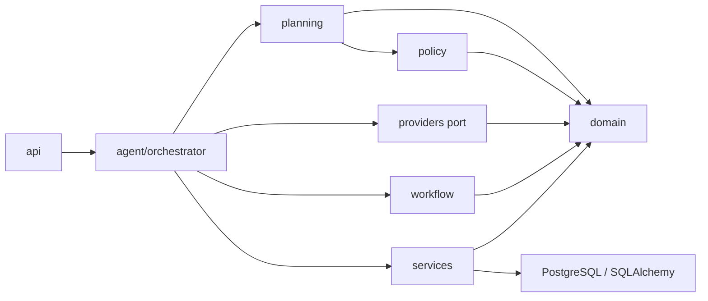
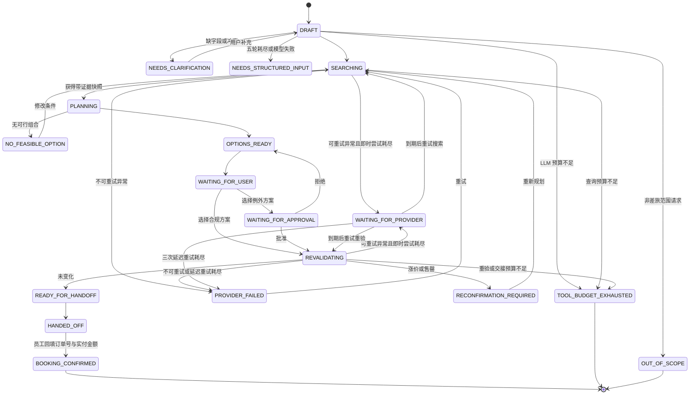

# V1 Agent 框架设计

## 1. 设计结论

框架采用一个有界 Workflow Orchestrator，而不是默认拆成多个 Agent。语言模型是被编排的能力端口，不能控制政策结论、状态转换、审批有效性或任何经济/外部副作用。

一次循环固定为：

```text
Observe  读取任务状态、版本、工具结果和有效期
Decide   由状态机确定允许动作
Act      调用有类型约束的 Provider 或 LLM 端口
Verify   schema、可行性、政策和不变量校验
Persist  保存对象、状态和证据哈希
Pause    等待用户、审批、重新确认或安全失败
```

## 2. 分层与依赖方向



`domain` 不依赖 FastAPI、数据库或供应商 SDK。当前可在内存与 PostgreSQL 仓储之间切换；把 Mock 替换为正式 TMC API 也不需要重写规划和政策核心。

`agent/orchestrator` 自 2026-09-01 起是一个包（ADR-0004）：`core` / `intake` / `planning` / `approval` /
`confirmation` / `resilience` / `records` 七个模块各管一个职责，`TripWorkflowOrchestrator` 由六个 mixin 组装，
状态全部在实例上、只在 `__init__` 里定义。行为和公开名字与拆分前逐字相同。

离线评测层使用严格 manifest 和固定来源哈希加载派生案例。PreferTripPlan 案例通过 Mock Provider 逐条运行同一个 Orchestrator、Planner 和 Policy Engine；Open-Travel 仅提供中文 query 与机器可检查的分类/缺失字段约束，不采用数据中的模型回答作为标准答案。

## 3. Agent 与确定性内核的边界

| 能力 | LLM | 确定性代码 |
|---|---:|---:|
| 自然语言意图提取 | 是 | schema 验证 |
| 硬/软约束初步分类 | 是 | 最终约束执行 |
| 搜索调整建议 | 仅白名单内 | 次数与范围控制 |
| 行程组合、成本和时间 | 否 | 是 |
| 合规结论 | 否 | 是 |
| 方案解释 | 仅引用 `explanation_facts` | 生成事实集 |
| 审批有效性、幂等和交接 | 否 | 是 |
| 员工习惯画像（从历史推偏好） | 否 | 是 |

语言模型只负责完整对话的语义解释、白名单查询调整和已验证方案解释。生产实现必须使用结构化输出，并在进入领域层前完成 schema 校验。

自然语言只有一条入口：工具循环（`POST /agentic/trip-tasks`，`agent/tool_loop.py`）。
模型每轮从固定工具表里挑零个或多个带类型的工具（查城市、搜交通、搜酒店、交付、提问；
**没有任何写操作**），宿主执行、校验、计预算、写审计，把结果喂回下一轮。信息够不够往下走，
由每个工具的签名决定，不再有一张全局必填表。结构化入口 `POST /trip-tasks` 直接接受
`TripRequestVersion`。曾经并行存在的 legacy（槽位抽取）和 semantic（一次性语义编译）两条入口
已于 2026-09-01 删除，理由与删除门槛见 [ADR-0003](adr/0003-single-product-entrypoint.md)；
[ADR-0002](adr/0002-single-owner-semantic-intent.md) 的不变量保留在 `compile_search_command`
和工具循环的评测替身里。

任务创建时固定 `intent_entrypoint`；已持久化的旧入口任务仍可读取，但不能续聊。

工具循环的参数进入领域层前逐项校验：每一段的日期必须逐字引用对话原话并且那句话真的定下
那一天（`_quote_fixes_date`）；交付的引用必须来自本轮真实搜到的库存；声明的要求只能用受支持
的名字（§3.3）。城市名经 `CityNormalizer` 映射为供应商使用的规范名称；未知别名保持原值交给
Provider 明确返回无库存，不做模型猜测。库存为空时，`NO_FEASIBLE_OPTION` 会区分去程、返程、
酒店无匹配与硬约束过滤。

### 3.1 统一工具预算

每个任务最多调用 12 次受控工具（工具循环入口 20 次——一轮要花两次：选工具一次、执行一次）。计数范围包括每轮选工具的模型调用、去返程/酒店查询、库存重验和交接链接创建；员工/政策内存读取、确定性规划与规则计算不计数。

- 每次调用前在任务聚合上原子预留一个序号；
- 成功和失败调用都消耗预算并保存 `ToolCallRecord`；
- 复问、重试和重新规划沿用原任务预算，不重置；
- 组合库存查询开始前先检查本轮所需名额，避免只取得部分行程数据；
- 名额不足进入终止态 `TOOL_BUDGET_EXHAUSTED`，且不允许创建 Booking Intent；
- `TOOL_CALL_STARTED / SUCCEEDED / FAILED` 和预算耗尽均写入审计轨迹。

### 3.2 上下文数据层：习惯只改排序

`services/travel_profile.py` 从这位员工**真的去订了的行程**（走到 `HANDED_OFF` 或
`BOOKING_CONFIRMED` 且选定了方案）里推出习惯偏好，喂给 `planning/preferences.py` 的既有罚分逻辑。
推断由确定性代码做，语言模型一个字都不参与。

四档来源，权重递减：`STATED`（这一轮亲口说的，全权重）>
`DECLARED`（自己填的档案）> `OBSERVED`（从本人历史推的）>
`ORG_DEFAULT`（同职级同常驻城市同事的常见选择，冷启动用）。
**这一轮说过的偏好，会让整个冲突族里的推断全部让位**——说了"这趟要飞"，
"平时坐高铁"就不再压分，否则两边互相抵消，排出来的顺序谁也解释不了。

已编码的边界，有测试盯着：

- 画像**不参与**可行性校验、**不参与**政策判定、**不改变**候选池；
  同一批库存带不带画像，方案集合与每条政策证据必须逐字一致；
- 少于 3 趟不推断，达不到 70% 不推断，每条推断都要带一句给员工看的理由；
- 画像算出来钉进任务（快照 ID 含内容哈希），此后这趟任务用同一份；
- 读历史失败不让任务失败，只写 `TRAVEL_PROFILE_UNAVAILABLE` 审计事件。

**这一层默认关闭**（`TripWorkflowOrchestrator(trip_history=None)`）。打开会改变排序
分数，既有评测基线与新数字不能直接对比，因此打开时必须新开报告目录重跑。

日历、CRM、HR 仍未接入，也**没有预留空端口**——按本仓库"声明即承诺"的规矩，
没有实现的名字不该存在。

### 3.3 工具循环的交付契约

产品入口里，模型交付方案靠 `propose_options`，收场靠 `ask_traveler`。三条宿主规则：

- **要求跟着方案走。** `propose_options.hard_constraints / soft_preferences` 用受支持的
  名字声明旅行者说过的要求；`_request_from_tool_loop` 按"管全程"写进请求，规划器据此过滤
  和排序。ref_id 本身不带这些——此前循环写出来的请求一条要求都不带，"只要直飞"到了规划器
  就没了，"优先高铁"也不参与排序。词表外的名字被拒绝，理由交回模型，它该把做不到的写进
  `open_questions`；`hotel_required` 没搜过酒店也被拒绝。
- **搜过了、每段都空、模型开口问 → `NO_FEASIBLE_OPTION`。** 不是一轮澄清：状态机本来就有
  这个格子，前端会摆出原因和"重新规划"，不占澄清轮数；空搜的出处和快照照记。
- **`ask_traveler(out_of_scope=true)` → `OUT_OF_SCOPE`。** 只在一段库存都没搜过时生效；和
  另外两条入口一样可以重开，也不占澄清轮数。

离线评测用 `agent/deterministic_tool_model.py` 做这条入口的替身（D16，见
`docs/evaluation-protocol.md` §3.2）。

## 4. 状态与暂停点



状态变化只能经过 `StateMachine.transition`。审批路径不存在到 `READY_FOR_HANDOFF` 的直达边，因此无法绕过重验。

### 4.1 交接之后：下单确认回流

`HANDED_OFF` 此前是终态，系统从那一刻起什么都看不见。现在多了一条出边：员工回填
订单号和实付金额（`POST /trip-tasks/{id}/booking-confirmation`），任务进入
`BOOKING_CONFIRMED`。这是交接之后系统能拿到的**第一条**"真的订了"的证据，业务指标层
（`services/evaluation_business.py`）的确认预订率、真实下单时刻的提前预订天数、实付偏差
都从它来。

边界，全部有测试：

- **自述，不是回执。** `BookingConfirmation.source` 只有 `SELF_REPORTED` 一档；订单号和
  金额系统核不了。指标和报表必须把这一点带着走。费控对账接上时再加第二档来源。
- **一个任务一条，写了不改。** 第二次回填被拒绝；填错了开新任务。改一条已经进了指标的
  记录等于让历史曲线悄悄变形。
- **只校验形状。** 订单号去空白去重、最多 10 个、每个 64 字符内、无控制字符；金额有限
  且不为负（允许 0：积分票、协议价预付都可能是 0）；币种三个大写字母，**不要求和方案币种
  一致**——员工用人民币付了美元报价是真事，差额算不算得出来是读的人的事；下单时刻带时区
  且不晚于现在，没填等于现在。
- **从 `READY_FOR_HANDOFF` 直接回填也行**：先记 `HANDOFF_COMPLETED`，再记 `BOOKING_CONFIRMED`，
  两条审计事件一条不少。交接链接过没过期不影响回填——链接管的是"能不能去订"，人已经订完回来了。
- **权限同其他工作流操作**：旅行者本人或管理员；审批人不能替员工填。
- 差额（实付 − 方案价）只有一个算法，在 `TripTask.booking_cost_variance()` 上；币种不一致
  返回 `None`，API 和指标都读它，不各算各的。

还没有的：`Trip`（一趟差旅）聚合。现在一个任务对应一次交接、一条确认，抽一个 `Trip` 只会是
空壳；等出现第二种任务（改期）需要挂在同一趟差旅下时再抽。

### 4.2 分级审批与事务性发件箱

审批链是政策的一部分，不是硬编码的"经理然后财务"。`PolicySnapshot.approval_tiers` 说的是
"什么情况下要多一个人批、由谁批"：方案总价过了某一档，或者违规/判不了的规则里有某一条
（演示配置：超过 5,000 美元、或预算规则出问题，就多一级财务 `F3001`）。`ApprovalRequest.steps`
记每一级谁批、批了没有；`approver_id` 始终是**当前**该批的那个人。走到第二级时，任务状态不动，
投影列 `pending_approver_id` 换人，经理的收件箱里它就没了、财务的才有（`GET /approvals/inbox`
按这一列查，不按直属经理）。任一级驳回整单驳回；过期整单作废；审批主题一变整单失效——
这些不变量没有因为多了级别而松动。

审批的每一步变化——建单、进下一级、批/驳、作废——以及下单确认，都作为发件箱事件
**和任务更新、审计事件同一笔事务**落库（`TaskRepository.record(..., outbox_events=...)`）。
审批单进了状态机却没通知出去，或通知出去了审批单其实没建成，都是不能接受的半截。

投递（`services/outbox_dispatch.py`）把未发布事件交给通道：`LoggingChannel`（没接外部系统时
的默认；收件箱本身就是投递）、`WebhookChannel`（POST 给企业侧地址，带事件 ID 和 HMAC 签名；
接真实 OA / 费控时用它）、`SimulatedApprovalSystemChannel`（仓库内扮演的外部审批系统：收到
通知记待办，决定后**回调**本系统——和真实 OA 调 `POST /approvals/{id}/decision` 是同一个动作）。
至少一次投递，通道按 `event_id` 幂等；失败计次，超过 `OUTBOX_MAX_ATTEMPTS` 进死信但**不标
已发布**。`examples/run_outbox_worker.py` 循环投递；管理员也可以 `POST /outbox/dispatch` 手动
跑一轮，`GET /outbox/events` 看有没有卡住。

### 4.3 费控对账：自述变成核实过

下单确认是员工说的（`SELF_REPORTED`），系统核不了。费控系统推来的报销记录
（`POST /expenses/import`，或 `SQLAlchemyExpenseRecordStore` 直接导入）按**旅行者 + 订单号**
和已确认的任务匹配：同币种金额相等 `MATCHED`，金额不等 `AMOUNT_MISMATCH`（两边都留着，差额摆
出来），币种不同 `CURRENCY_MISMATCH`（不换算），任务已对过账 `DUPLICATE`。对上了就在任务上钉一条
`ExpenseReconciliation`（`EXPENSE_RECONCILED` 审计事件），确认记录本身不改——员工当时说的和费控后来
说的都留着。不做模糊匹配：猜错一次，"核实过"三个字就不值钱了。

**费控里有、本系统里没有的记录（`UNMATCHED`）就是渠道外预订**：员工绕开系统订的那部分。
`GET /metrics/business` 的 `off_channel_expense_rate` 从导入的记录里算，第一次有了真值；此前只能
拿"交接完成率"往上估。预算账本对过账的用费控的数，没对过的用自述。导入按 `expense_id` 幂等。

### 4.4 一趟差旅、观察对象与改期任务

`Trip` 是任务之上的聚合（`services/trips.py`，表 `trips`，迁移 0010）：第一个规划任务建它
（`PLANNED`），下单确认让它进入 `BOOKED` 并登记 `TripWatch`——盯着确认方案的每一段（票号、
起降时刻），盯到最后一段落地后一天。此前不抽这个聚合，是因为一个任务对应一次交接、一条确认，
抽出来只会是空壳；现在有了第二种任务，它才有内容。

变更事件（`POST /trips/{id}/events`）有两种：航变 `FLIGHT_CHANGED`（航司/供应商推送，
管理员身份报，必须对上观察对象里的某张票）和会议改期 `MEETING_MOVED`（旅行者或发起人自己报，
带新的最晚到达时刻，`leg_index` 指明改的是哪一段，默认第一段）。事件被接受的条件：差旅处于
`BOOKED`/`REBOOKED`，观察期没过；取消了的、改期进行中的一律拒绝。事件从哪来见 §4.6。接受之后
**开一个新的改期任务**挂在同一趟差旅下（`parent_task_id`、`change_event_id`），原任务的审计一个
字不动；改期任务复用原请求，会议改期改那一段的最晚到达时刻并把出发窗口按同样的时间差平移（会议从
20 号推到 22 号，搜的就是 21 号傍晚到 22 号上午，不是三天宽的窗口），航变把被取消的那张票排除在候选之外——
这不是改库存，是"航司说这张票没了，就别再端上来"。改期任务同样走规划、政策、审批、交接、
确认；它确认了，差旅进入 `REBOOKED`。发件箱里多一条 `TRIP_CHANGE_REQUESTED`。

差旅聚合和任务**同一笔事务**落库（`SQLAlchemyTaskRepository.add_with_trip`）：新差旅插一行，已有差旅按
乐观锁更新，改期事件也在这一笔里写进差旅——要么一起成，要么一起回滚。前提是两张表共用一个引擎；
任务在 SQL、差旅在内存（单测常见）时退回先任务后差旅。2026-09-01 之前这里是三次写，改期任务建了
而差旅没记上时 `find_by_task` 找不到它，已修。

业务指标多了两条：`change_auto_planned_rate`（改期任务里系统直接摆出方案的比例）和
`change_intervention_rate`（人不得不插手的比例——设计文档里的"变更场景人工介入率"）。

### 4.5 管理端看板

管理员登录后的默认视图（前端 `DashboardView`），三块只读数据、三个只对管理员开放的接口：

| 块 | 接口 | 数据从哪来 | 不做什么 |
|---|---|---|---|
| 业务结果 | `GET /metrics/business` | 最近任务的审计事件 + 费控记录，`services/evaluation_business` 同一套口径，附 `labels` | 分母为零不写 0，卡片上写"测不出来" |
| 谁在哪（duty of care） | `GET /duty-of-care?at=` | 差旅聚合的观察对象：员工回填了下单确认的那份方案的航段，按 `at` 判在途 / 在目的地 / 未出发（`services/duty_of_care.py`） | 没确认的行程不出现——系统不知道人到底订没订，就不假装知道人在哪；观察期过了默认不出现 |
| 预算消耗 | `GET /budgets` | 政策里的成本中心额度、账本里确认过的支出、已交接还没回填的"在途"金额（选定方案的价格） | 在途不进账本；账本没接时支出显示"账本未接"而不是 0 |

### 4.6 航班动态、影响评估与取消

事件从哪来，2026-09-02 起有四条路，全部落到同一个 `report_trip_event` / `cancel_trip`：

| 路 | 入口 | 谁 | 经过什么 |
|---|---|---|---|
| **被动 · 轮询** | watch worker（`process_due_flight_checks`；`examples/run_trip_watch_worker.py`，或 `PROCESS_ROLE=worker/all` 进程内线程） | 航班动态源 `FlightStatusPort`（`providers/flight_status.py`） | 影响评估 |
| **被动 · 推送** | `POST /flight-status/webhook`（HMAC-SHA256，`FLIGHT_STATUS_WEBHOOK_SECRET`）；`POST /trips/{id}/flight-status`（管理员） | 企业 TMC / 航司推送 | 影响评估 |
| **主动 · 聊天** | 已订任务（`BOOKING_CONFIRMED`）上的 `POST /agentic/trip-tasks/{id}/messages` → `submit_change_message` | 旅行者 / 发起人 | 变更意图（`agent/change_intent.py`） |
| **主动 · 表单** | `POST /trips/{id}/events`（会议改期，可指定 `leg_index`）、`POST /trips/{id}/cancel` | 旅行者 / 发起人 | 直接落事件 |

**观察节奏**（`services/change_impact.next_flight_check_at`）：下单确认时把第一次检查排在最早一段
起飞前 48 小时（`TRIP_WATCH_LOOKAHEAD_HOURS`）；48–12 小时每 6 小时，12–3 小时每小时，
3 小时内每 15 分钟，起飞到落地每 30 分钟，全部落地后不查。`trips.next_check_at` 是投影列
（迁移 0012），worker 按它领取，写 `watch_lease_owner/until` 租约，Postgres 上 `SKIP LOCKED`；
**保存即释放**。没接动态源（`FLIGHT_STATUS_SOURCE=none`，默认）worker 一趟都不领。

**影响评估**（`services/change_impact.assess_flight_change`）是确定性代码，和政策引擎同一类：
输入是事实（动态源说的状态与预计时刻），输出是可复核的结论，每条带 `reasons`。

| 结论 | 什么时候 | 然后 |
|---|---|---|
| `REBOOK_REQUIRED` | 取消；新到达晚于"到场时限 − 安全缓冲"（`arrival_buffer_minutes`，只对留缓冲的那一段）；和下一段接不上（`TRIP_CHANGE_MIN_CONNECTION_MINUTES`） | `report_trip_event(FLIGHT_CHANGED, impact=…)` 开改期任务，事件带评估 |
| `NOTIFY_ONLY` | 时刻变了、超过 `FLIGHT_DELAY_NOTICE_MINUTES`，但仍来得及 | 发件箱 `TRIP_FLIGHT_STATUS_NOTICE`，行程不动 |
| `NO_CHANGE` | 按计划、变化在阈值内、已起飞/落地、动态源判不了 | 只记观察 |

每次非重复观察在**被观察任务**上记 `FLIGHT_STATUS_OBSERVED`（这是关于它那张票的事实，不是改它）；
同一段同样的状态再来一次不再通知、不再记审计。最近一次观察挂在 `TripWatch.observations` 上，
`GET /trips/{id}` 能看到，前端已订面板按段显示。改期进行中（`CHANGE_REQUESTED`）的差旅不再领取，
旧票已经在换了。只带票号、不带 `trip_id` 的推送对每一趟盯着这张票的差旅都算数——同一班航班上
可能坐着好几位旅行者。

**取消**（`cancel_trip`）：差旅进入 `CANCELLED`，事件 `TRIP_CANCELLED`，`next_check_at` 置空，
发件箱 `TRIP_CANCELLED`，谁在哪看板不再显示，之后的事件和聊天变更一律拒绝。**不动任何任务状态**——
任务记录的是当时规划了什么。退票、改签仍由人去官方平台办；退改费系统记不到。

**聊天改期**（`submit_change_message`）：模型只有两个终局工具——`request_trip_change` 和
`ask_traveler`——没有搜索、没有规划。关卡在工具签名上：会议改期必须带 `new_arrive_by`，且
`date_evidence` 逐字抄旅行者原话、那句话里真的定下这一天（和搜索的日期出处关卡同一条
`_quote_fixes_date`）；航变自述必须指到已订行程里的票号（事件 note 标"旅行者自述："）；
取消只要理由。打回去的原因原样喂回模型，最多两轮；读不出来就问一句，任务状态不变。会议改期
开出的改期任务把这句话带过去（`CHANGE_MESSAGE_CARRIED`）。这次模型调用记审计但**不占**已订任务
的工具预算。

## 5. 证据与版本

每个候选方案绑定：

- `TripRequestVersion`；
- 一个或多个 `InventorySnapshot` ID；
- `EmployeeProfileSnapshot`；
- `PolicySnapshot`；
- `PolicyDecision.evidence`；
- 只允许解释层引用的 `explanation_facts`。

审批主题哈希包含请求版本、员工快照、政策快照、方案版本、价格和违规集合。修改请求或重新规划会使旧审批失效。

### 5.1 外部政策配置与快照固定

`POLICY_CONFIG_FILE` 指向 schema 版本化的 JSON 文件。启动时 `EnterpriseTravelPolicyConfig` 以 `extra=forbid` 和严格类型模式一次性验证城市、审批人、员工、职级规则、酒店上限、例外白名单、IANA 时区及全部跨对象引用；任一错误都会阻止 API 启动。未设置变量时仅加载随包发布的 Demo 配置。

配置可同时携带当前及历史 `PolicySnapshot`。`active_policy_snapshot_id` 只决定新任务绑定哪个快照，旧任务通过自己的快照 ID 查找历史版本。新任务还固定该政策的规范内容 SHA-256；如果运营人员复用已有快照 ID 改写内容，旧任务会停止并要求恢复历史快照，而不会静默按新规则继续。

员工快照完整嵌入任务聚合，因此员工职级或审批路径变化不会回写历史任务。配置升级必须追加政策快照；员工资料升级必须递增资料版本并更换快照 ID。

### 5.2 政策的四个维度与预算快照

差标不是"一个夜费上限"。政策快照现在有四个维度，每条规则都有"不判"和"判不了"两种口径，
**它们不是一回事**——政策没配这条规则就不产证据；配了却拿不到数据才是"判不了"，摆出来请人定：

| 规则 | 输入 | 口径 |
|---|---|---|
| `hotel.city.nightly_cap` | 城市基础上限 | 原有 |
| `hotel.city.seasonal_cap` | `hotel_seasonal_caps`：城市 × 日期窗口 × 上限 | 入住日落在窗口内就**替代**基础上限；窗口重叠取更严的 |
| `booking.advance_days` | `min_advance_booking_days` + 规划时刻 | 按出发地当地**日历日**数；没有规划时刻的诊断调用不判 |
| `budget.cost_center.remaining` | 成本中心预算 + `BudgetSnapshot` | 整趟总价对余额；只在调用方要求整趟判定时判 |

预算是**数据闭环反过来喂管控**：上限写在政策快照里，用掉多少来自员工回填的下单确认
（`services/budget_ledger.py`），规划那一刻算成 `BudgetSnapshot` 钉进任务
（`task.metadata["budget_snapshot"]`）。和习惯画像同一个道理：别人下一秒确认了一单、余额变了，
这趟"当初为什么这么判"仍然答得上来。账本没接上时规则判成"判不了"，任务照常出方案。

后加的三个字段都是可选的，而且**只有写了才进内容哈希**：旧快照一个字不改，哈希一位不变
（`tests/test_policy_config.py` 冻结了演示 v1 的哈希）。演示配置因此是追加了 `policy-travel-v2`
再切换 active，v1 留档。

## 6. Provider 契约

Provider 统一实现：

```python
search_transport(query) -> InventorySnapshot
search_hotels(query) -> InventorySnapshot
revalidate(refs) -> RevalidationResult
create_deep_link(option) -> ProviderHandoff
```

`ProviderError` 与空库存是不同状态，不能被转换为“无结果”。不可重试错误直接进入
`PROVIDER_FAILED`；明确标记为无外部副作用的瞬时只读错误，在 3 次即时尝试耗尽后进入
`WAITING_FOR_PROVIDER`。熔断器打开 60 秒；配了 `DATABASE_URL` 时"打开到几点"写进
`provider_circuit_state` 表（`SQLAlchemyProviderCircuitStore`），所有实例共用：A 实例判定供应商挂了，
B 实例下一次调用前就知道，不再各自撞一遍；半开探测仍按进程各自做。存储读写失败只记日志、退回
本地状态。后台处理器按持久化时间最多进行 3 次任务级延迟重试，成功后继续原流程，耗尽后进入
`PROVIDER_FAILED`。任何外部写操作都不允许盲目进入该重试链路。

延迟重试消费者默认不运行在 API worker：`PROCESS_ROLE=worker` 的 uvicorn 进程，或不开 HTTP 的
`examples/run_provider_retry_worker.py`（装配和 API 完全一样）。专用 worker 通过数据库原子 claim 取得任务，持有
有上限的 lease 和唯一 fencing token；lease 到期可被其他 worker 接管，任何旧 token 的迟到
状态写回都会被仓储拒绝。到期查询走状态/时间索引；重启时的中断任务恢复只查四个瞬时状态
（`list_by_states`），不再 `list_tasks()` 全表反序列化——陈旧与否仍按活动时间在内存里判，因为
`updated_at` 是墙钟而业务时钟可能被冻结。关闭先停止新 claim，再等待在途调用 drain。

Provider 与 Orchestrator 共享同一时钟来源。库存快照必须包含有效时区，且 `valid_until` 必须晚于采集和使用时刻；交接链接在创建 Booking Intent 前也必须仍然有效。任一校验失败均进入 `PROVIDER_FAILED` 并写入拒绝事件。

Duffel/LiteAPI 搜索在返回快照前，通过 `ProviderQuoteContextStore` 保存最小、无凭证的重验
上下文。内存与 SQL 是该 seam 的两个 adapter；SQL 允许另一 worker 或重启后的进程读取同一
`provider + snapshot + ref_id` 上下文。读取上下文不代表报价仍有效：adapter 先检查供应商
`expires_at`，随后必须发起真实 revalidate 请求。缺失、过期和损坏分别以稳定错误码 fail
closed，并可通过重新规划/搜索恢复。过期上下文有 TTL 清理，内存 adapter 另有容量上限。

当前实现：

- `MockProvider`：正常、超时、涨价、售罄、重验失败；
- `ReplayProvider`：按统一查询哈希回放不可变快照；
- `ReplayDataset`：从受限 WORM 原文导出脱敏原文和无内部引用的标准化快照，以严格 manifest、文件 SHA-256、路径约束和源快照去重实现磁盘回归库。

Mock、Replay 和数据集导出器共用 `inventory_query_hash`，避免同一查询在不同入口生成不同键。数据集加载时会重新计算查询哈希、验证所有文件、重新执行脱敏扫描并逐字段绑定 manifest 与快照；任一不一致都拒绝加载。当前自动脱敏覆盖身份/凭证键、邮箱、手机号、身份证号、Bearer/JWT 和 URL 凭证/查询，真实数据仍要求授权与人工复核。

Browser-assisted 与正式 Ctrip Business Provider 应作为后续独立适配器加入；它们不能绕过登录、验证码、平台限流或用户可见确认。

## 7. 已编码不变量

- 无来源快照的库存不会进入方案；
- 不可行方案在规划阶段被硬过滤；
- `FORBIDDEN` 或证据不足方案不会展示为可选；
- 未批准例外无法进入重验；
- 任何选择都必须在交接前重验；
- 涨价、售罄或重验失败不会创建 Booking Intent；
- 过期库存快照或交接链接不会进入 `READY_FOR_HANDOFF`；
- 请求变化使旧审批失效；
- 同一请求版本和方案版本只能对应一个幂等 Booking Intent；
- 任一任务不会执行第 13 次 LLM/Provider 工具调用；
- V1 只有交接意图，没有支付、出票、退改签工具。

## 8. 持久化

当前提供内存与 SQLAlchemy 两种 `TaskRepository`：

- PostgreSQL/JSONB 保存版本化任务聚合，审批与 Booking Intent 随聚合恢复；
- 任务更新和对应审计事件在同一数据库事务中提交；
- `persistence_revision` 作为乐观锁，陈旧写入返回并发冲突；
- 审计事件使用任务内单调序号恢复确定顺序；
- 规范化 `InventorySnapshot` 独立保存，并拒绝同 ID 不同内容的覆盖；
- 规范化前的 Provider JSON 写入 `RawResponseObjectStore`，库存快照只保存不可变引用；
- 本地 WORM 后端以 `0600` 文件保存正文和元数据，相同对象键不可覆盖；
- 原文保留期默认 90 天，读取策略只允许系统回放或审计管理员；
- HTTP 层不提供原文下载，只公开哈希、大小、保留期和访问策略；
- 待重试任务保存延迟次数、下一次执行时间和恢复操作；后台调度器在请求线程之外执行，
  服务重启后仍可继续；
- Alembic 管理表、索引、外键和有效期约束；
- API 可通过 `DATABASE_URL` 切换仓储，并通过 `RAW_RESPONSE_STORE_DIR` 启用持久原文归档。
- 服务启动时会恢复持久化为 `STARTED` 的中断工具调用：LLM 草稿转结构化输入，
  Provider 的不确定中断转为 `PROVIDER_FAILED` 并要求先对账，不做盲目重试；已持久化的
  `WAITING_FOR_PROVIDER` 则继续按原计划调度。
- 任务表维护查询投影（`employee_id` / `manager_id` / `next_retry_at` 等），列表与延迟重试
  不再依赖全表 hydrate；`GET /trip-tasks` 默认返回摘要。
- 政策配置可经 `POLICY_CONFIG_BACKEND=postgres` 从 active 文档加载；文件后端仍为默认。
- 事务性 Outbox（`outbox_events`）已接入：审批各步与下单确认随任务更新同一事务入队，投递见 §4.2。

运维与环境变量见 `docs/postgres-operations.md`。

当前本地 WORM 后端用于内部试用；正式环境仍需接入启用 Object Lock 和服务端加密的 S3 兼容后端。其他未完成的生产化部分还有 Secret Store（Outbox 投递 worker 见 §4.2）。

## 9. 认证与资源级授权

内部试用认证由 `AuthService` 提供：密码使用 scrypt 加盐哈希，登录后签发带 HMAC-SHA256 完整性保护的短期不透明会话令牌。令牌只保存用户 ID、签发/过期时间和随机 ID；角色与员工绑定每次从当前凭证配置读取，因此停用账号可立即阻止后续认证。

| 角色 | 任务读取 | 工作流操作 | 审批决定 |
|---|---|---|---|
| `employee` | 是任务的旅行者，或任务的发起人（代订的助理） | 允许 | 禁止 |
| `approver` | 用户 ID 是任务的直属经理，或当前待批的审批人 | 禁止 | 只能批**当前这一级** |
| `admin` | 全部 | 允许 | 禁止冒充经理 |

**发起人 ≠ 旅行者。** 任务记两个人：`employee`（旅行者，差标、审批、预算、习惯全看他）和
`requester_id`（发起人）。谁能替谁发起由员工档案的委托名单决定（`EmployeeConfig.delegates`，
单向：高管列了助理，助理就能替高管订，反过来不行）；API 层按身份查一次，编排器再按目录查一次
（`_requester_for`）。管理员、系统身份不在员工目录里，能不能建任务由角色管。`GET /auth/me` 的
`can_book_for` 告诉前端"我可以替谁订"；`GET /trip-tasks` 对员工返回"我是旅行者的 + 我发起的"
（投影列 `requester_id`，迁移 0008）。审批通知里两个人都有。

**差旅与变更事件的可见性。** `GET /trips` 对员工返回"我是旅行者或发起人"的差旅，管理员看全部；
`GET /trips/{id}` 同理。`POST /trips/{id}/events`：航变（`FLIGHT_CHANGED`）代表航司/供应商推送，
只有管理员能报；会议改期（`MEETING_MOVED`）旅行者或发起人自己就能报。开出来的改期任务和普通任务
一样受上表约束。

启用认证后所有任务、审计和库存快照端点都要求 Bearer 令牌。越权读取与不存在资源统一返回 `404`；审批身份由令牌派生，不信任请求体。`AUTH_ENABLED=false` 只保留给本机开发兼容。

正式生产仍需用企业 OIDC/SSO 替换本地凭证文件，并在身份平台或 API 网关实现 MFA、集中吊销、登录限流和安全事件采集。
