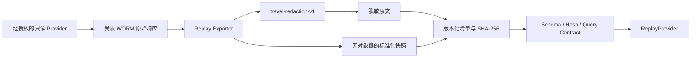

# 脱敏 Replay 数据集

## 目标与边界

Replay 库用于对 Provider 标准化、空结果、异常字段和查询匹配执行确定性回归。它不是订单库，也不得保存账号凭证、Cookie、访问令牌、员工身份信息或 WORM 内部对象键。

“20 个真实快照”只统计来源为 `AUTHORIZED_API` 或 `BROWSER_ASSISTED` 的唯一原始响应。`MOCK` 数据可验证工具链，但不计入目标；相同源响应 SHA-256 在多个数据集中出现时，整库校验会失败，不能重复计数。

## 数据流



原始响应只能通过带 `system_replay` 读取上下文的导出器访问。导出过程：

1. 校验 WORM 引用与原始 SHA-256；
2. 对敏感键、邮箱、手机号、身份证号、Bearer/JWT 和带凭证或查询参数的 URL 执行递归脱敏；
3. 检查标准化 `InventorySnapshot` 不含同类敏感值，并删除 `raw_response` 内部引用；
4. 将查询、快照、脱敏原文、来源类型、计数和各文件 SHA-256 写入严格清单；
5. 以 `0600` 权限创建新目录，拒绝覆盖已有数据集。

自动脱敏只是导入安全门，不代表数据可公开。真实数据仍需由数据所有者确认授权范围，并在离开内部环境前进行人工复核。

## 导出一个已持久化任务

先确保 `DATABASE_URL` 和 `RAW_RESPONSE_STORE_DIR` 指向该任务使用的数据库与 WORM 根目录：

```bash
.venv/bin/python examples/export_replay_dataset.py \
  TASK_ID \
  data/replay-datasets/DATASET_ID \
  --dataset-id DATASET_ID \
  --dataset-version 1
```

一个新任务通常产生去程、返程和酒店三个快照。每次导出必须使用新的目录和 `dataset_id`；不要修改已导出的文件。

## 校验单个数据集

```bash
.venv/bin/python examples/validate_replay_dataset.py \
  data/replay-datasets/DATASET_ID
```

该命令验证 schema、文件哈希、路径安全、脱敏残留、快照字段绑定和每个查询的 Replay 命中。

## 校验整个回放库

```bash
.venv/bin/python examples/validate_replay_library.py data/replay-datasets
```

整库校验会拒绝重复数据集 ID 和重复源快照，并分别输出 Mock 与真实来源数量、查询契约数量，以及距离 20 个真实快照的剩余数量。

## 当前样例

`data/replay-datasets/mock-smoke-20260801` 来自已验收的 Mock 任务，包含两个交通查询和一个酒店查询。它证明导出、哈希、权限和 Replay 契约可工作，但真实数据进度仍为 `0/20`。
